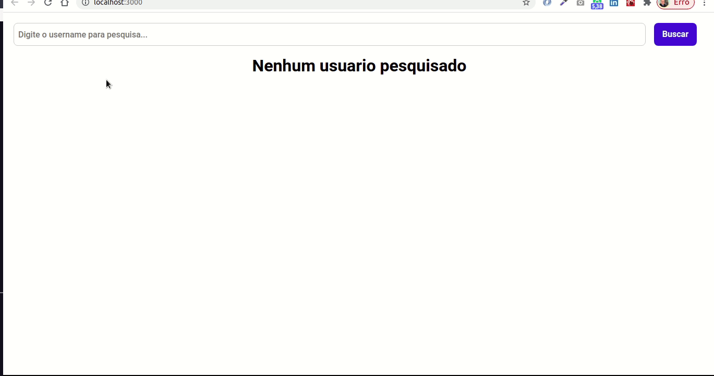

<!--Banner session-->

  

<!--About session-->
<h1 align="center">Laboratórtio DIO. Criando um front-end totalmente componentizado na prática com ReactJS.</h1>
 
Como resultado temos uma página, na qual podemos pesquisar por usuários do Github, usando apenas seu username.
 Digital Innovation One

[Digital Innovation One](https://digitalinnovation.one/).

## Requisitos para o projeto rodar:

### Instalação npm
$ sudo apt install nodejs

### Axios
Promise based HTTP client for the browser and node.js
$ npm install axios

### Criando um app React
npx create-react-app my-app
cd my-app
npm start

OU

$ yarn create react-app my-app

### Executar o app:
$ npm start ou yarn start

Executa o aplicativo em modo de desenvolvimento.
Abra http: // localhost: 3000 para visualizá-lo no navegador.

### Para executar um projeto já criado sem a pasta node_modules, deve executar no terminal:
$ yarn install ou npm install